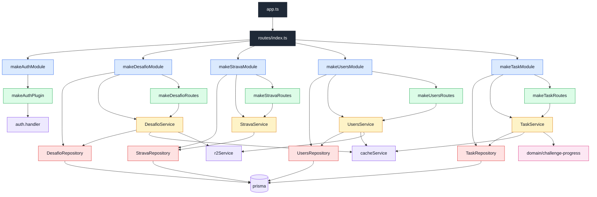

# CodeGraph da Arquitetura Atual

## Leitura

- `routes/index.ts` eh o composition root dos modulos.
- Cada `make*Module` instancia as dependencias concretas do modulo.
- As rotas recebem o service pronto e registram via `.decorate()`.
- Services concentram regra/orquestracao.
- Repositories encapsulam Prisma.
- `task` eh o unico modulo com `domain/`, porque tem regra pura reutilizavel.
